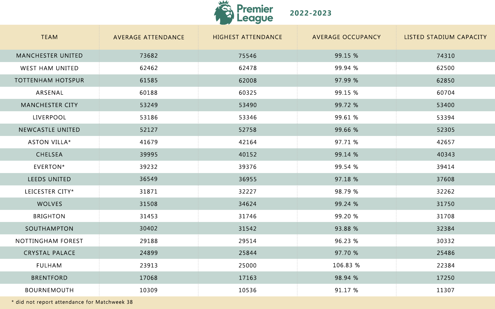

<strong>ABOUT</strong> 
 
Premiere League attendance for 2022/23 season is over. This quick repo lists average attendance, max attendance, average stadium occupancy, and lists official stadium capacity for all the clubs in the Premier League.

<strong>NOTES</strong> 
 
Some PL stadiums have listed capacity for Premier League games and for other events. For example, Etihad Stadium (Manchester City) is listed at 53400 for Premier League games and London Stadium (West Ham United) at 60000, although both can pack more people. It is clear from the stats that West Ham had sold more than 62000 tickets for home games, therefore I used official capacity for London Stadium (62500) instead the one from the Premier League Manual (60000). Manchester City most likely never intended (for whatever reasons) to sell more than 53400 for PL matches, so I decided to go with the PL manual capacity of 53400 instead of listed 55000. 
  
Fulham's Craven Cottage did some renovation work but listed capacity remained at 22384 (both in PL manual and officially). Fulham reported twelve games with sold tickets above 24K and one with 25K. This could be a generous overestimate by the club.  

<strong>OTHER NOTES</strong> 
 
June 8th, 2023 updated data. The only missing attendance is now Aston Villa's last home game

<strong>SCREENSHOTS</strong>
